之前提到`Android`的`URLConnection`因为不支持`ALPN`，从而不支持`HTTP/2`。而`OkHttp 2.5`以上，是支持`ALPN`和`HTTP/2`，但对平台有要求，限于`Android 5.0`以上。那为什么会有平台的差异呢，度娘上有人说，是因为`openssl`，需要`openssl 1.0.2`以上才支持`TLS`，而我手上的`Android 4.4`用的是`openssl 1.0.1e`，是不是这个原因呢，我们先从`OkHttp`入手。

## 一、相关接口是否存在?
在`OkHttp`的源码`okhttp3.internal.platform.Platform.java`中
注释中有这么一段：

> Access to platform-specific features.
> …
> ALPN (Application Layer Protocol Negotiation)
> 
> Supported on Android 5.0+. The APIs were present in Android 4.4, but that implementation was unstable.
> 
> Supported on OpenJDK 7 and 8 (via the JettyALPN-boot library).
> 
> Supported on OpenJDK 9 via SSLParameters and SSLSocket features.
> …

意思看起来是说，这部分的`API`在`4.4`里面是存在的，只是执行不稳定？？？不稳定，那还是有的嘛。继续看`Platform.java`:

```java
/** Attempt to match the host runtime to a capable Platform implementation. */
private static Platform findPlatform() {
    Platform android = AndroidPlatform.buildIfSupported();
    if (android != null) {
        return android;
    }

    Platform jdk9 = Jdk9Platform.buildIfSupported();

    if (jdk9 != null) {
        return jdk9;
    }

    Platform jdkWithJettyBoot = JdkWithJettyBootPlatform.buildIfSupported();

    if (jdkWithJettyBoot != null) {
        return jdkWithJettyBoot;
    }

    // Probably an Oracle JDK like OpenJDK.
    return new Platform();
}
```

可以看到，`Android`平台的适配是通过`AndroidPlatform.java`实现，在`buildIfSupported()`方法中：

```java
public static Platform buildIfSupported() {
    // Attempt to find Android 2.3+ APIs.
    try {
        Class<?> sslParametersClass;
        try {
            sslParametersClass = Class.forName("com.android.org.conscrypt.SSLParametersImpl");
        } catch (ClassNotFoundException e) {
            // Older platform before being unbundled.
            sslParametersClass = Class.forName("org.apache.harmony.xnet.provider.jsse.SSLParametersImpl");
        }

        OptionalMethod<Socket> setUseSessionTickets = new OptionalMethod<>(null, "setUseSessionTickets", boolean.class);
        OptionalMethod<Socket> setHostname = new OptionalMethod<>(null, "setHostname", String.class);
        OptionalMethod<Socket> getAlpnSelectedProtocol = null;
        OptionalMethod<Socket> setAlpnProtocols = null;

        // Attempt to find Android 5.0+ APIs.
        try {
            Class.forName("android.net.Network"); // Arbitrary class added in Android 5.0.
            getAlpnSelectedProtocol = new OptionalMethod<>(byte[].class, "getAlpnSelectedProtocol");
            setAlpnProtocols = new OptionalMethod<>(null, "setAlpnProtocols", byte[].class);
        } catch (ClassNotFoundException ignored) {
        }

        return new AndroidPlatform(sslParametersClass, setUseSessionTickets, setHostname, getAlpnSelectedProtocol, setAlpnProtocols);
    } catch (ClassNotFoundException ignored) {
        // This isn't an Android runtime.
    }

    return null;
}
```

看到没，`OkHttp`通过查找一个在`Android 5.0+`才存在的类`android.net.Network.java`，来判断平台版本，而从指定类中反射出两个方法来，其中关键的是`getAlpnSelectedProtocol()`， 这里只是缓存了一个可选的方法名、返回值、参数等等，在后面会通过反射调用到，那这个指定的类是什么呢，先别管，我们先把`Class.forName("android.net.Network");`这行注释掉，让他强制跑在`4.4`上，看看是否前面说的，`API`是存在的，但不稳定的，找`getAlpnSelectedProtocol()`具体调用的地方：

```java
@Override public String getSelectedProtocol(SSLSocket socket) {
    if (getAlpnSelectedProtocol == null) return null;
    if (!getAlpnSelectedProtocol.isSupported(socket)) return null;
    byte[] alpnResult = (byte[]) getAlpnSelectedProtocol.invokeWithoutCheckedException(socket);
    return alpnResult != null ? new String(alpnResult, Util.UTF_8) : null;
}
```

`isSupported()`通过反射判断`target`是否存在相应的方法：

```java
/**
* Returns true if the method exists on the supplied {@code target}.
*/
public boolean isSupported(T target) {
    return getMethod(target.getClass()) != null;
}
```

`debug`模式运行到这里我们发现：

 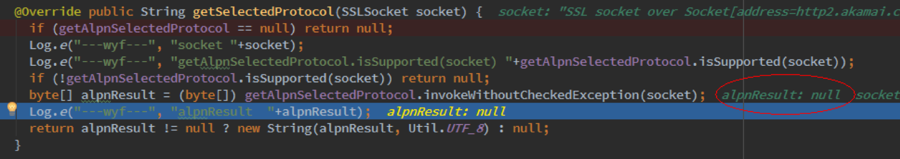
 
上面是`4.4`的运行结果，可以执行通过，只是得到的结果`alpnResult`是空的，而在`5.0`的机器上，这里是有值的，解析成字符串，是`h2`：

 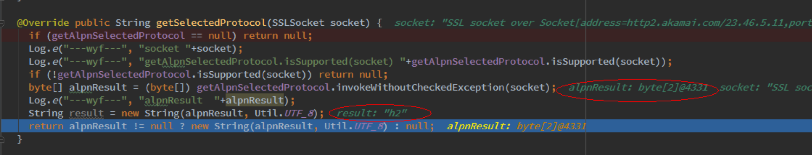

看来正如官方文档所说，`getAlpnSelectedProtocol()`这个接口在`4.4`上存在的，只是因为没有得到正确的结果，返回为空，所以`unstable`?


## 二、为什么getAlpnSelectedProtocol返回为空？
接下来我们看看是哪个类持有这个接口，`debug`可以看到：

  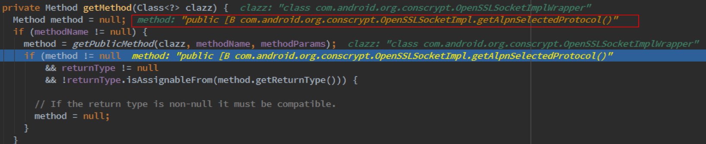
  
原来是一个叫`com.android.org.conscrypt.OpenSSLSocketImplWrapper`的类，那么这个类的源码在那里呢，很遗憾，`Android SDK`开发包提供下载的`sources`里面是找不到的。。。它在这里：

  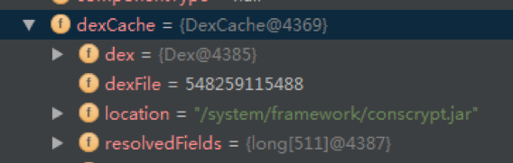
 
所以我们要找`conscrypt.jar`的源码， `OpenSSLSocketImplWrapper`其实是`OpenSSLSocketImpl`的子类：[https://android.googlesource.com/platform/external/conscrypt/+/android-5.0.0_r1/src/main/java/org/conscrypt/OpenSSLSocketImpl.java](https://android.googlesource.com/platform/external/conscrypt/+/android-5.0.0_r1/src/main/java/org/conscrypt/OpenSSLSocketImpl.java)

还有`4.4`的，我可是翻了很久才找到的：
[https://android.googlesource.com/platform/external/conscrypt/+/e75878c72b717696d7e4f6cc1052f1cdaca3bda8/src/main/java/org/conscrypt/OpenSSLSocketImpl.java](https://android.googlesource.com/platform/external/conscrypt/+/e75878c72b717696d7e4f6cc1052f1cdaca3bda8/src/main/java/org/conscrypt/OpenSSLSocketImpl.java)

两者的实现差不多，都包含:

```java
/**
* Returns the protocol agreed upon by client and server, or {@code null} if
* no protocol was agreed upon.
*/
public byte[] getAlpnSelectedProtocol() {
    return NativeCrypto.SSL_get0_alpn_selected(sslNativePointer);
}
```
从注释可以看到，是需要客户端和服务端都同意`ALPN`，才会有返回值，具体实现，是个`Native`方法：

```java
/**
* Returns the selected ALPN protocol. If the server did not select a
* protocol, {@code null} will be returned.
*/
public static native byte[] SSL_get0_alpn_selected(long sslPointer);

```

那这个`native`方法指向哪里呢，没错，它指向了`openssl`，

`openssl-1.0.2j` 下载：[https://www.openssl.org/source/openssl-1.0.2j.tar.gz](https://www.openssl.org/source/openssl-1.0.2j.tar.gz)

`openssl-1.0.1e` 下载：[https://www.openssl.org/source/old/1.0.1/openssl-1.0.1e.tar.gz](https://www.openssl.org/source/old/1.0.1/openssl-1.0.1e.tar.gz)

在`openssl-1.0.2j\include\openssl\ssl.h`中可以找到：

```c
void SSL_get0_alpn_selected(const SSL *ssl, const unsigned char **data,
                            unsigned *len);
```

而在`openssl-1.0.1e\include\openssl\ssl.h`中：
 


我勒个去，`Unable to find… ` 原来这就是`unstable`的原因啊！！！

## 三、替换openssl

既然`Android 4.4`的`openssl-1.0.1e`缺少`SSL_get0_alpn_selected `，那我们换成`openssl-1.0.2j`试试。

编译过程在这里：[Android Openssl交叉编译](./../android_openssl.html)

另外，`Openssl`官方`wiki`有个`Android`环境编译教程：
[https://wiki.openssl.org/index.php/Android#Acquire_the_Required_Files](https://wiki.openssl.org/index.php/Android#Acquire_the_Required_Files)

可惜编译出来的没法使用：

```bash
CANNOT LINK EXECUTABLE: could not load library "libandroid_runtime.so" needed by "app_process"; caused by could not load library "libcrypto.so" needed by "libandroid_runtime.so"; caused by "libcrypto.so" has bad ELF magic
```

或者`caused by "libssl.so" has bad ELF magic`

替换完成后`debug`到`getAlpnSelectedProtocol()`：

 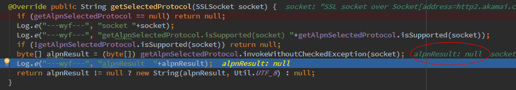
 
`alpnResult`还是`null`。。。最终协商结果还是`HTTP/1.1`:

> D/---wyf---: Protocol: http/1.1

## 四、这到底是为什么
从前面`getAlpnSelectedProtocol()`方法的注释说明：

```java
/**
* Returns the protocol agreed upon by client and server, or {@code null} if
* no protocol was agreed upon.
*/
public byte[] getAlpnSelectedProtocol() {
    return NativeCrypto.SSL_get0_alpn_selected(sslNativePointer);
}
```

还有`SSL_get0_alpn_selected`的注释说明：

```c
/*
* SSL_get0_alpn_selected gets the selected ALPN protocol (if any) from
* |ssl|. On return it sets |*data| to point to |*len| bytes of protocol name
* (not including the leading length-prefix byte). If the server didn't
* respond with a negotiated protocol then |*len| will be zero.
*/
void SSL_get0_alpn_selected(const SSL *ssl, const unsigned char **data, unsigned int *len)
{
    *data = NULL;
    if (ssl->s3)
        *data = ssl->s3->alpn_selected;
    if (*data == NULL)
        *len = 0;
    else
        *len = ssl->s3->alpn_selected_len;
}
```

可以看到，是需要客户端和服务端都同意`ALPN`协商，而`SSL_get0_alpn_selected`只是从协商结果中判断是否能使用`HTTP/2`，难道不是`openssl`的问题？那问题出在哪呢 

## 五、TLS链接建立和ALPN协商过程
看来有必要从头了解一下`HTTP/2`请求过程，我们在浏览器上访问一下`HTTP/2`网站，抓包看看：
 
首先，`Client`向`Server`发送一个`ClientHello`消息，说明它支持的密码算法列表、压缩方法及最高协议版本，以及稍后将被使用的随机数：
 
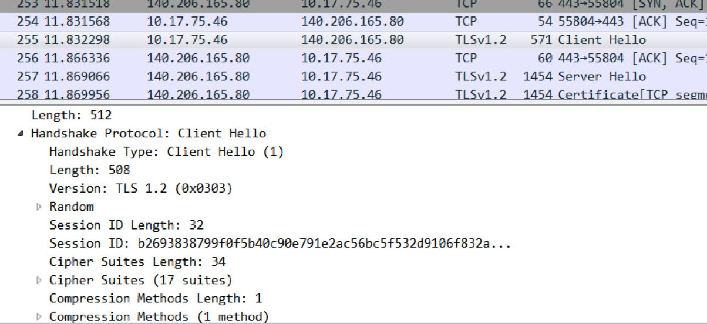

在`TLSv1.2`中，会有个扩展字段`Extension`，通过`ALPN`扩展列出了自己支持的各种应用层协议，比如`h2`、`http/1.1`：

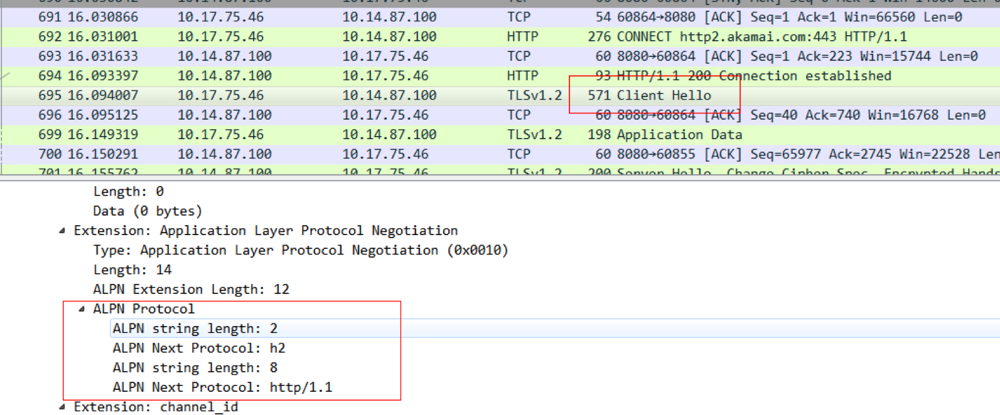
 
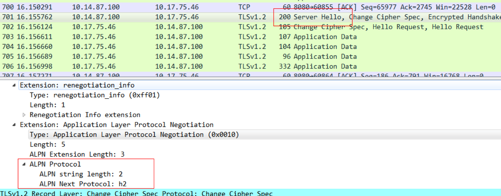

然后服务端会在`Server Hello`中选取所支持的加密算法和密钥大小，以及支持的协议，如果服务端支持`HTTP/2`，指定`ALPN`的协商结果为`h2`就可以了；如果服务端不支持`HTTP/2`，就会从客户端的 `ALPN`支持列表中选一个自己可以支持的。比如下面这图，服务端选择了降级成`HTTP/1.1`：

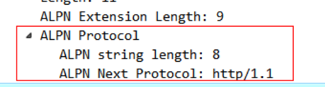

这就是`TLS`链接建立`ALPN`协商的过程。

其中`ALPN`被包含了在`TLS v1.22`的`Extension`字段中，查看[TLS wiki](https://en.wikipedia.org/wiki/Transport_Layer_Security#TLS_1.2)，在`1.2`以前的版本是没有`Extension`字段的，看来问题的关键在于`TLS`的版本。

## 六、TLS支持
我们来看看`Android`所支持的`TLS`版本：[https://developer.android.com/reference/javax/net/ssl/SSLSocket.html](https://developer.android.com/reference/javax/net/ssl/SSLSocket.html)

 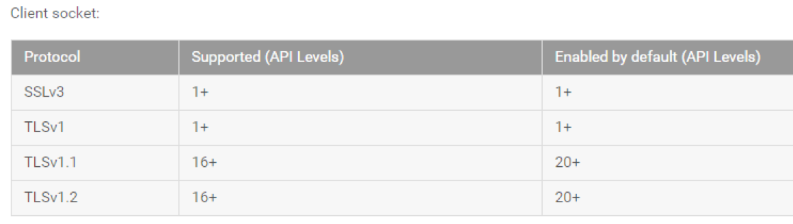

好吧，`API 16`（`4.1`）就提供支持，但`API 20`（`5.0`）才默认打开。。。

那能不能手动打开呢，先看一下执行结果：

`5.0`：在初始化的`ssLSocketFactory`的时候，`sslParameters`里面`enabledProtocls`列表包含了`TLSv1.2`：
 
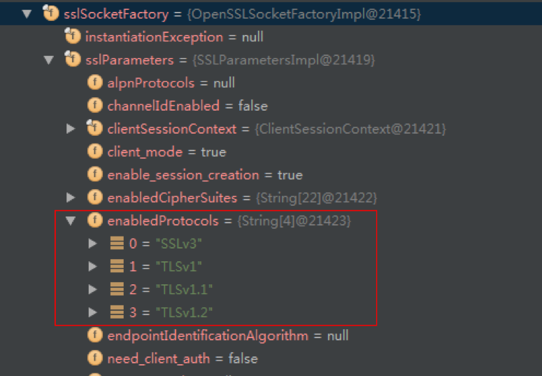

`4.4`：只有`TLSv1`：
 
 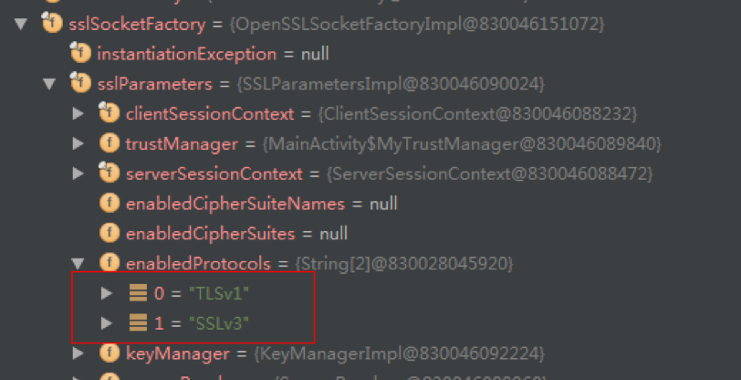

再看初始化`sslParameters`的源码：

`5.0`下：
`com.android.org.conscrypt.SSLParametersImpl.java`:

```java
protected SSLParametersImpl(KeyManager[] kms, TrustManager[] tms, SecureRandom sr, ClientSessionContext clientSessionContext, ServerSessionContext serverSessionContext) throws KeyManagementException {
    this.serverSessionContext = serverSessionContext;
    this.clientSessionContext = clientSessionContext;
    // initialize key managers
    if (kms == null) {
        x509KeyManager = getDefaultX509KeyManager();
        // There's no default PSK key manager
        pskKeyManager = null;
    } else {
        x509KeyManager = findFirstX509KeyManager(kms);
        pskKeyManager = findFirstPSKKeyManager(kms);
    }
    // initialize x509TrustManager
    if (tms == null) {
        x509TrustManager = getDefaultX509TrustManager();
    } else {
        x509TrustManager = findFirstX509TrustManager(tms);
    }
    // initialize secure random
    // We simply use the SecureRandom passed in by the caller. If it's
    // null, we don't replace it by a new instance. The native code below
    // then directly accesses /dev/urandom. Not the most elegant solution,
    // but faster than going through the SecureRandom object.
    secureRandom = sr;
    // initialize the list of cipher suites and protocols enabled by default
    enabledProtocols = getDefaultProtocols();
    boolean x509CipherSuitesNeeded = (x509KeyManager != null) || (x509TrustManager != null);
    boolean pskCipherSuitesNeeded = pskKeyManager != null;
    enabledCipherSuites = getDefaultCipherSuites(x509CipherSuitesNeeded, pskCipherSuitesNeeded);
}


private static String[] getDefaultProtocols() {
    return NativeCrypto.DEFAULT_PROTOCOLS.clone();
}

```

`com.android.org.conscrypt. NativeCrypto.java`:

```java
public static final String[] DEFAULT_PROTOCOLS = new String[] {
    SUPPORTED_PROTOCOL_SSLV3,
    SUPPORTED_PROTOCOL_TLSV1,
    SUPPORTED_PROTOCOL_TLSV1_1,
    SUPPORTED_PROTOCOL_TLSV1_2,
};
```

`4.4`下：

`com.android.org.conscrypt.SSLParametersImpl.java`:

```java
// protocols available for SSL connection
private String[] enabledProtocols = ProtocolVersion.supportedProtocols;
```

`com.android.org.conscrypt. ProtocolVersion.java`:

```java
/**
* Protocols supported by this provider implementation
*/
public static final String[] supportedProtocols = new String[] { "TLSv1", "SSLv3" };
```

所以不管是`4.4`还是`5.0`，支持的`TLS`版本都被写死在了外部扩展库`conscrypt.jar`里面。


所以看来需要重新编译`Android 4.4`的源码才能解决了。。。
