`Google`提供的生成物理参数校准和生成`profile`的页面：
[https://vr.google.com/intl/zh-CN_cn/cardboard/viewerprofilegenerator/]()

在页面的上半部分介绍了使用方式：

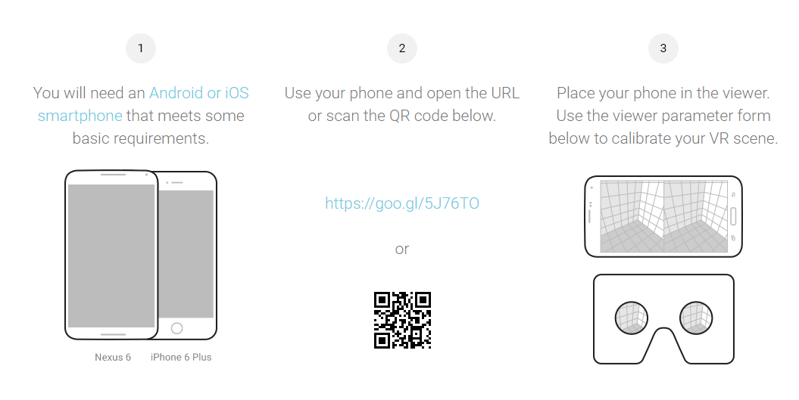

具体步骤

1. 拿出你的手机
2. 通过手机浏览器打开或扫描页面中提供的校准效果观察页面，由于该地址是可变的，所以不要在这里扫描
3. 打开页面后，有些手机浏览器可能无法获取你的手机的`PPI`，需要自己填入，输入不准确会影响校准效果
4. 横置手机，可以看到下图所示的界面，放入`VR`眼镜中，就可以观察校准过程：

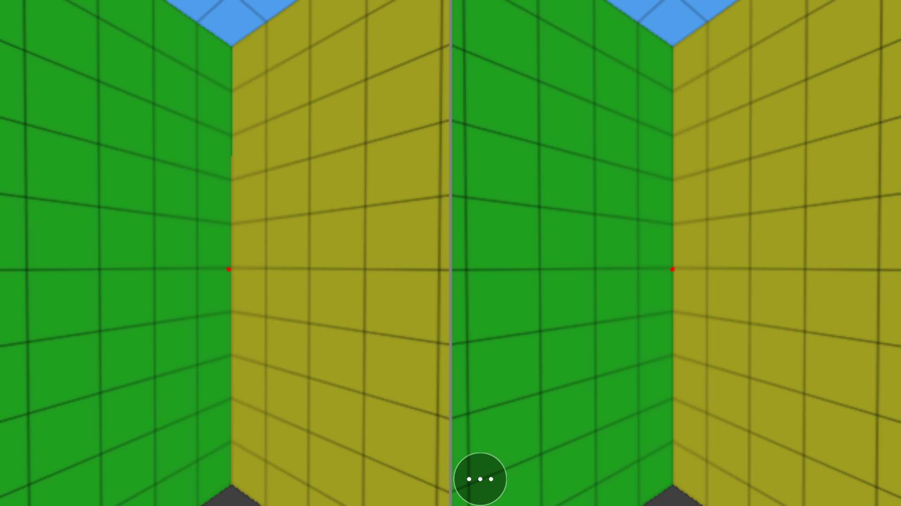

页面的下半部分是与现实相关的重要物理参数的设置表格，输入相应的参数，就可以通过`VR`眼镜观看校准页面来观察校准效果:

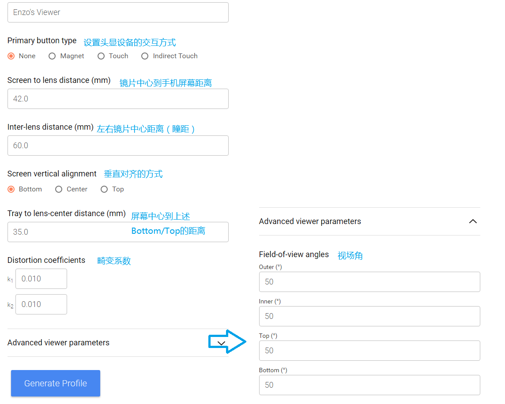

### 参数说明：

* Screen to lens distance:
镜片中心到手机屏幕的垂直距离，可通过游标卡尺测量，主要影响图像的大小，如果设置过大，人眼会观察到显示区域的边缘。

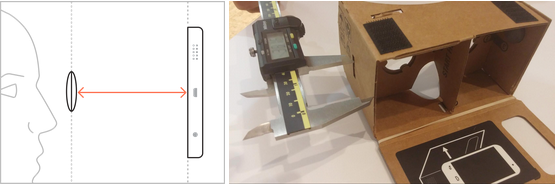

* Inter-lens distance
两个镜片中心距离，可通过游标卡尺测量

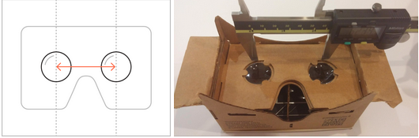

通过`VR`眼镜观察校准页面的中心红点的重合度和清晰度来判断，不正确的参数，会观察到左右分离的两个红点：

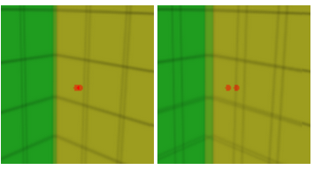

而正确的参数，中心红点是完美重合，边缘锐利，并且肉眼可以轻松聚焦。

还有一个方式可以判断参数是否正确，即直接测量手机屏幕上两个红点的距离，应该跟表格填入数据是一致：

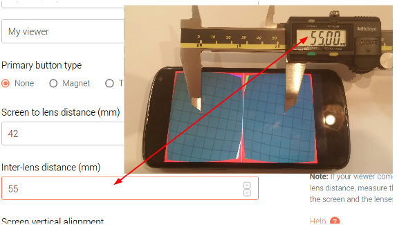

* Screen vertival alignment：
屏幕垂直对齐方式，分为`Bottom`、`Top`、`Center`，通常都是`Bottom`：

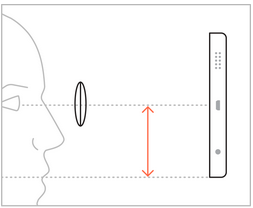

如果这里选择`Bottom`或者`Top`，则会用到下一个参数：

* Tray  to lens-center distance：
即`Bottom`／`Top`到镜片中心的距离，正确的参数，观察到校准页面中心红点距离屏幕上下方的距离应该是相等的

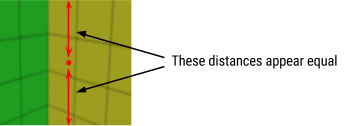

* Field-of -view angles
即视场角，包含`Outer`（外视场角）、`Inner`（内视场角）、`Top`（上视场角）、`Bottom`（下视场角）

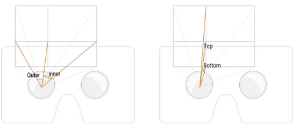

一般来说，在物理光学系统中，视场角的大小决定了光学仪器的视野范围，视场角越大，视野就越大。

但对于我们开发VR应用来说，这组参数只是决定了显示画面的渲染区域的大小，设置太小的视场角，绘制的区域过小，就会很容易观察到显示区域的边缘，设置过大则浪费计算性能。`GVR`的默认参数是50，适用于绝大部分头显设备。

* Distortion coefficient
畸变系数，最为重要也是最难获取的参数，所有光学镜片都存在光学畸变，包括径向畸变（`Radial Distortion`）和切向畸变（`Tangential Distortion`），这里讲的畸变系数指的是径向畸变的校准系数。

径向畸变的产生原因是光学镜片从中心到边缘对于光线的折射率不同，导致光线通过光学镜片不同区域产生不同程度的折射弯曲。径向畸变包括桶形畸变（`Barrel Distortion`）和枕形畸变（`Pincushion Distortion`）。我们在`VR`眼镜中观察到的多是枕形畸变。

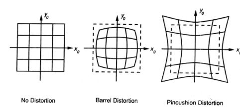

光学畸变的存在会导致我们通过VR眼镜观看到的场景变形，从而影响体验，于是我们需要通过畸变模型和设置畸变系数来校正成像。

校正基本原理是产生相反的畸变，例如故意让成像产生桶形畸变，来抵消的枕形畸变影响。

这里使用的是布朗畸变模型：

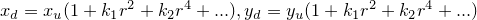

其中，`(xd, yd)`是变形后的坐标，`(xu, yu)`是未变形的坐标，`kn`为形变系数，`r`为形变半径：

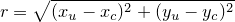

`(xc, yc)`是主点（`principal point`），因此r即为未变形点到形变中心点的距离。布朗模型符合泰勒级数展开，而在实际情况下，径向畸变较小，所以其可以用主点周围的泰勒级数展开的前几项进行描述，`GVR`使用的是简化的理想模型，只使用了两个形变系数`k1`和`k2`。

因此我们只需要知道正确的`k1`和`k2`，并填入到表格中，例如：

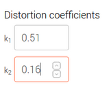

这时候直接观察手机屏幕，可以看到明显的桶形畸变：

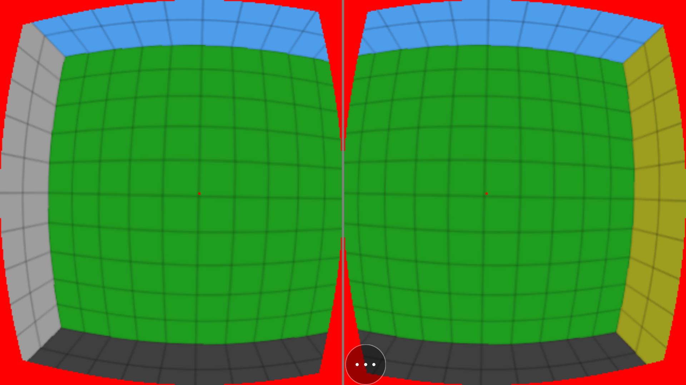

这时候再通过`VR`眼镜观察，所有弯曲的线条就都变直了。

如果无法得到`VR`眼镜准确的`k1`和`k2`值，我们也可以通过在表格中上下微调`k1`、`k2`的数值，肉眼观察校准页面横竖线条的变化，当观察到边缘区域横竖线条夹角越接近90度，所得到`k1`、`k2`值越准确。

### 输出参数profile
当所有参数校准完成，就可以通过页面最下方的`Generate Profile`，产生一个二维码：

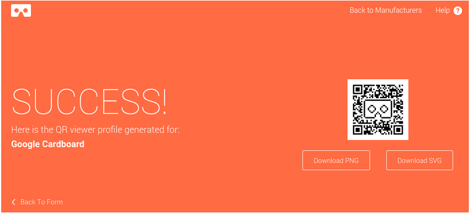

如果手机上装有`Google Cardboard app`，就可以通过在`setting`中扫描二维码来导入刚才生成的`profile`： 

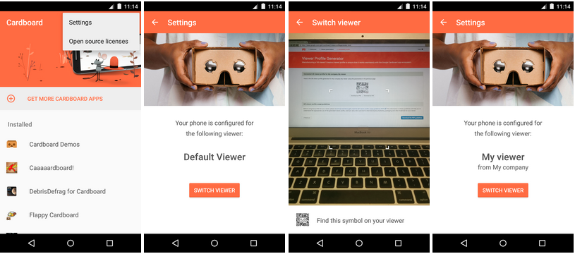

这种方式需要我们安装`Google Cardboard app`，比较间接也不方便。