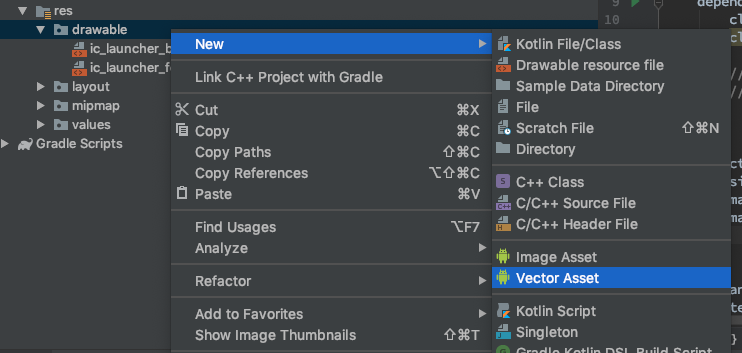
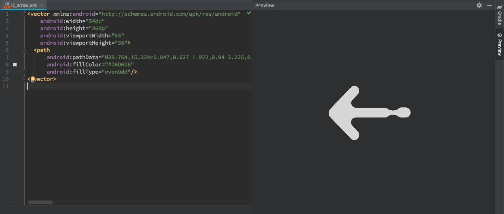

一直以来，在Android开发中使用的图片资源都是jpg或者png格式的。Android各种坑爹的分辨率，使得我们不得不为同一图片资源准备多份来适应不同的分辨率，导致最终安装包大小变的很大，即使如此也无法很好的解决问题。所以最近开始在手头的项目中尝试使用SVG。

> SVG -- 可缩放矢量图形（英语：Scalable Vector Graphics，SVG）是一种基于可扩展标记语言（XML），用于描述二维矢量图形的图形格式。SVG由W3C制定，是一个开放标准。----摘自[维基百科](https://zh.wikipedia.org/wiki/%E5%8F%AF%E7%B8%AE%E6%94%BE%E5%90%91%E9%87%8F%E5%9C%96%E5%BD%A2)

SVG很好的解决了适配分辨率的烦恼，作为矢量图形，可以做到无级放大且不会出现锯齿，同时自身由于是xml文件，自身体积也比较小，达到控制了安装包大小的目的。

在Android上使用SVG并不是直接把SVG文件直接拖入到工程资源文件夹中，而是需要转换成VectorDrawable或者绘制Canvas的代码。这里有个SVG描述的箭头：

```xml
<svg xmlns="http://www.w3.org/2000/svg" width="54" height="36" viewBox="0 0 54 36">
    <path fill="#D6D6D6" fill-rule="evenodd" d="M38.754 15.334c.847.627 1.922.94 3.225.94 1.336 0 2.38-.275 3.134-.826a3.242 3.242 0 0 1 2.428-1.09h2.5a3.25 3.25 0 1 1 0 6.5h-2.5a3.24 3.24 0 0 1-2.27-.926 6.718 6.718 0 0 0-3.292-.861c-1.111 0-2.126.267-3.042.802a2.992 2.992 0 0 1-2.217.978H18.054a3 3 0 0 0-2.206 5.034l3.735 4.05a3 3 0 0 1 .083 3.974l-.326.384a2.858 2.858 0 0 1-4.234.137L1.88 20.742a4 4 0 0 1-.015-5.544L15.135 1.32a2.868 2.868 0 0 1 4.229.092l.26.296a3 3 0 0 1-.08 4.043l-3.532 3.722a3 3 0 0 0 2.176 5.065H36.72c.785 0 1.5.302 2.034.795z"/>
</svg>
```

我们看看怎么做两种转换并使用：


## 一、VectorDrawable
VectorDrawable是Google从Android 5.0开始引入的一个专门用于处理矢量图的Drawable子类，并通过support-library向下支持到Android 4.0。

### 创建VectorDrawable
VectorDrawable一般不需要手动创建，而是通过Android Studio的新建Vector Asset文件功能，在项目res\drawable目录下点击鼠标右键可以看到：



点击进入：


* Asset Type： 选择Local file
* Name： 输入一个合适的文件名
* Path： 想要转换的SVG文件的路径
* Size： 如果原图是非正方形尺寸，一定要勾选Override，否则图形会被拉伸变形。具体尺寸那里默认即可。
* Opacity：根据具体需要输入。
* Enable auto mirroring for RTL layout：是否要自动适应右到左布局（阿拉伯国家的文字是右到左），一般不需要。

最后选择Next然后再Finish，就可以看到res\drawable目录下多了个刚刚你命名的xml文件，比如：

```xml
<vector xmlns:android="http://schemas.android.com/apk/res/android"
    android:width="54dp"
    android:height="36dp"
    android:viewportWidth="54"
    android:viewportHeight="36">
  <path
      android:pathData="M38.754,15.334c0.847,0.627 1.922,0.94 3.225,0.94 1.336,0 2.38,-0.275 3.134,-0.826a3.242,3.242 0,0 1,2.428 -1.09h2.5a3.25,3.25 0,1 1,0 6.5h-2.5a3.24,3.24 0,0 1,-2.27 -0.926,6.718 6.718,0 0,0 -3.292,-0.861c-1.111,0 -2.126,0.267 -3.042,0.802a2.992,2.992 0,0 1,-2.217 0.978H18.054a3,3 0,0 0,-2.206 5.034l3.735,4.05a3,3 0,0 1,0.083 3.974l-0.326,0.384a2.858,2.858 0,0 1,-4.234 0.137L1.88,20.742a4,4 0,0 1,-0.015 -5.544L15.135,1.32a2.868,2.868 0,0 1,4.229 0.092l0.26,0.296a3,3 0,0 1,-0.08 4.043l-3.532,3.722a3,3 0,0 0,2.176 5.065H36.72c0.785,0 1.5,0.302 2.034,0.795z"
      android:fillColor="#D6D6D6"
      android:fillType="evenOdd"/>
</vector>
```

vector标签表示这是一个VectorDrawable，这里可以看到几个属性：

 * width & height： 图片宽高，对应SVG文件中的width & height。
 * viewportWidth & viewportHeight： 用于定义viewport空间的宽高，对应SVG文件中的viewBox。viewport可以理解为绘制paths的画布，上面的* 例子可以理解为在54dp * 36 dp的空间里面，有 54 * 36个网格，图片的paths数据就绘制在这些网格当中。

内层的path标签描述的是paths绘制的信息，比如具体路径，画笔的颜色类型等等，上面例子出现的属性：

 * pathData：绘制的具体路径，对应SVG文件中path标签下的d属性
*  fillColor：画笔的颜色，对应SVG文件中path标签下的fill属性
*  fillType：画笔的类型，对应SVG文件中path标签下的fill-rule属性。类型可以是evenOdd或nonZero。 有关更多详细信息，请参考([https://www.w3.org/TR/SVG/painting.html#FillRuleProperty](https://www.w3.org/TR/SVG/painting.html#FillRuleProperty))

这里只出现了部分属性，更多的属性请自行参考[https://developer.android.google.cn/reference/android/graphics/drawable/VectorDrawable](https://developer.android.google.cn/reference/android/graphics/drawable/VectorDrawable)，这里就不一一展开了。

上述的属性都可以自行修改，同时在preview界面可以很直观的观察修改效果：




### 使用VectorDrawable
首先需要给项目添加兼容性支持，在build.gradle脚本中添加：

```groovy
android { 
    defaultConfig { 
        vectorDrawables.useSupportLibrary = true 
    } 
}
```

VectorDrawable的使用跟一般的图片资源使用方式是一样的，比如用在ImageView上面：

```xml
<ImageView
   android:layout_width="100dp"
   android:layout_height="100dp"
   android:src="@drawable/ic_arrow"/>
```

或者作为背景：

```xml
<View
    android:layout_width="100dp"
    android:layout_height="100dp"
    android:background="@drawable/ic_arrow" />
```

是不是非常简单。

## 二、转换成Canvas
前面的VectorDrawable最终呈现，还是要绘制在Canvas上的，那可不可以直接将SVG转换成绘制Canvas的代码来使用呢？老外已经做了这个事情了：[SVG2Java/SVG2Android](https://codecrafted.net/svgtoandroid)

这是一个在线工具，只要上传SVG文件就可以很方便的生成Java代码，上面的箭头生成的代码如下：

```java
// TODO Include your package name here

import android.graphics.Canvas;
import android.graphics.Color;
import android.graphics.Matrix;
import android.graphics.Paint;
import android.graphics.Path;
import android.graphics.PorterDuff;
import android.graphics.PorterDuffColorFilter;

public class ArrowSvgObject {
    private static final Paint  p  = new Paint();
    private static final Paint  ps = new Paint();
    private static final Path   t  = new Path();
    private static final Matrix m  = new Matrix();
    private static float od;
    protected static ColorFilter cf = null;

    /
       IMPORTANT: Due to the static usage of this class this
       method sets the tint color statically. So it is highly
       recommended to call the clearColorTint method when you
       have finished drawing. 
     
       Sets the color to use when drawing the SVG. This replaces
       all parts of the drawable which are not completely
       transparent with this color.
     /
    public static void setColorTint(int color){
        cf = new PorterDuffColorFilter(color, PorterDuff.Mode.SRC_IN);
    }

    public static void clearColorTint(int color){
        cf = null;
    }

    public static void draw(Canvas c, int w, int h){
        draw(c, w, h, 0, 0);
    }

    public static void draw(Canvas c, int w, int h, int dx, int dy){
        float ow = 54f;
        float oh = 36f;

        od = (w / ow < h / oh) ? w / ow : h / oh;

        r();
        c.save();
        c.translate((w - od  ow) / 2f + dx, (h - od  oh) / 2f + dy);

        m.reset();
        m.setScale(od, od);

        c.save();
        ps.setColor(Color.argb(0,0,0,0));
        ps.setStrokeCap(Paint.Cap.BUTT);
        ps.setStrokeJoin(Paint.Join.MITER);
        ps.setStrokeMiter(4.0fod);
        c.scale(1.0f,1.0f);
        c.save();
        p.setColor(Color.parseColor("#D6D6D6"));
        t.reset();
        t.moveTo(38.75f,15.33f);
        t.cubicTo(39.6f,15.96f,40.68f,16.27f,41.98f,16.27f);
        t.cubicTo(43.31f,16.27f,44.36f,16.0f,45.11f,15.45f);
        t.lineTo(50.04f,14.36f);
        t.lineTo(47.54f,20.86f);
        t.cubicTo(40.87f,19.07f,39.85f,19.34f,38.94f,19.87f);
        t.lineTo(18.05f,20.85f);
        t.lineTo(19.58f,29.94f);
        t.lineTo(19.34f,34.29f);
        t.lineTo(1.88f,20.74f);
        t.lineTo(15.13f,1.32f);
        t.lineTo(19.62f,1.71f);
        t.lineTo(16.01f,9.47f);
        t.lineTo(36.72f,14.54f);
        t.cubicTo(37.5f,14.54f,38.22f,14.84f,38.75f,15.33f);
        
        t.transform(m);
        c.drawPath(t, p);
        c.drawPath(t, ps);
        c.restore();
        r(1,0,3,2);
        p.setColor(Color.parseColor("#D6D6D6"));
        c.restore();
        r();

        c.restore();
    }

    private static void r(Integer... o){
        p.reset();
        ps.reset();
        if(cf != null){
            p.setColorFilter(cf);
            ps.setColorFilter(cf);
        }
        p.setAntiAlias(true);
        ps.setAntiAlias(true);
        p.setStyle(Paint.Style.FILL);
        ps.setStyle(Paint.Style.STROKE);
        for(Integer i : o){
            switch (i){
                case 0: ps.setStrokeCap(Paint.Cap.BUTT); break;
                case 1: ps.setColor(Color.argb(0,0,0,0)); break;
                case 2: ps.setStrokeMiter(4.0fod); break;
                case 3: ps.setStrokeJoin(Paint.Join.MITER); break;
            }
        }
    }
};
```

只要将该文件拷贝到工程中即可，如果曾经使用过Android Canvas，很快就能看的懂，这里描述了如何一笔一笔的绘制出图片的过程。

### 作为自定义View使用
重写自定义View的onDraw方法：

```kotlin
override fun onDraw(canvas: Canvas?) {
    super.onDraw(canvas)
    ArrowSvgObject.getDrawable(
        canvas,
        viewRect.width(),
        viewRect.height()
    )
}
```
   
### 作为Drawable使用

```kotlin
val icon = ArrowSvgObject.getDrawable(size);
imageView.setImageDrawable(icon);
```

### 作为Icon Tinting使用

```kotlin
val blueTintedIcon = ArrowSvgObject.getTintedDrawable(
                                size, Color.BLUE);
```

## 总结
 一般情况推荐使用VectorDrawable，比较简单方便。
 如果是想要一些特殊的实现，比如给图形加一些偏移量，或者做一些位移旋转的动画，则使用Canvas方式，更直接。


> 最后补充：在H5上，也有类似的Canvas实现方式，比如基于 canvg.js的在线工具[svg2canvas](http://demo.qunee.com/svg2canvas/)