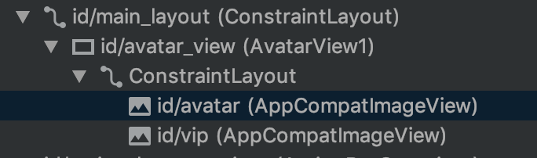
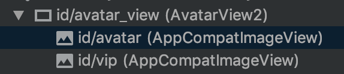
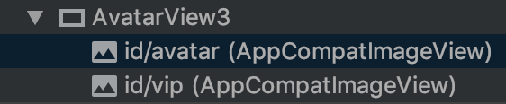
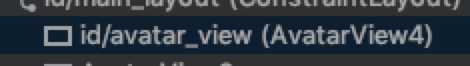

通常遇到一些固定用法的组合布局，会把它们做成一个自定义`View`，以方便重复使用。比如说一个头像加一个`Vip`标志：


刚开始的时候，可能会这样写：

layout：

```xml
<?xml version="1.0" encoding="utf-8"?>
<android.support.constraint.ConstraintLayout xmlns:android="http://schemas.android.com/apk/res/android"
    xmlns:app="http://schemas.android.com/apk/res-auto"
    android:layout_width="wrap_content"
    android:layout_height="wrap_content">

    <ImageView
        android:id="@+id/avatar"
        android:layout_width="50dp"
        android:layout_height="50dp"
        app:layout_constraintBottom_toBottomOf="parent"
        app:layout_constraintEnd_toEndOf="parent"
        app:layout_constraintStart_toStartOf="parent"
        app:layout_constraintTop_toTopOf="parent" />

    <ImageView
        android:id="@+id/vip"
        android:layout_width="16dp"
        android:layout_height="16dp"
        android:src="@drawable/vip"
        app:layout_constraintBottom_toBottomOf="@+id/avatar"
        app:layout_constraintEnd_toEndOf="@+id/avatar" />

</android.support.constraint.ConstraintLayout>
```

code：

```kotlin
class AvatarView1 @JvmOverloads constructor(
    context: Context,
    attrs: AttributeSet? = null,
    defStyleAttr: Int = 0
) : FrameLayout(context, attrs, defStyleAttr) {

    override fun onFinishInflate() {
        super.onFinishInflate()
        LayoutInflater.from(context).inflate(R.layout.avatar_view_1, this, true)
    }

    fun setAvatar(url: String) {
        ...
    }
}
```

没毛病，但是`AvatarView1`自身的根布局多产生了一层嵌套：



那么如何能减少这一层嵌套呢，有两种方法：

### 1. 使用merge标签

* 让自定义`View`的类继承布局文件的根布局。
* 将布局文件的根布局改成`merge`标签。

code：

```kotlin
class AvatarView2 @JvmOverloads constructor(
    context: Context,
    attrs: AttributeSet? = null,
    defStyleAttr: Int = 0
) : ConstraintLayout(context, attrs, defStyleAttr) {

    ...
}
```

layout：

```xml
<?xml version="1.0" encoding="utf-8"?>
<merge xmlns:android="http://schemas.android.com/apk/res/android"
    xmlns:app="http://schemas.android.com/apk/res-auto"
    android:layout_width="wrap_content"
    android:layout_height="wrap_content"
    xmlns:tools="http://schemas.android.com/tools"
    tools:parentTag="android.support.constraint.ConstraintLayout">

    <ImageView
        android:id="@+id/avatar"
        android:layout_width="50dp"
        android:layout_height="50dp"
        app:layout_constraintBottom_toBottomOf="parent"
        app:layout_constraintEnd_toEndOf="parent"
        app:layout_constraintStart_toStartOf="parent"
        app:layout_constraintTop_toTopOf="parent" />

    <ImageView
        android:id="@+id/vip"
        android:layout_width="16dp"
        android:layout_height="16dp"
        android:src="@drawable/vip"
        app:layout_constraintBottom_toBottomOf="@+id/avatar"
        app:layout_constraintEnd_toEndOf="@+id/avatar" />

</merge>
```
> tools:parentTag="android.support.constraint.ConstraintLayout"，加入该属性可以保持preview中的预览效果

使用：

```xml
<com.ezstudio.view.AvatarView2
    android:id="@+id/avatar_view"
    android:layout_width="50dp"
    android:layout_height="50dp" />
```

运行后可以看到，布局层次少了一层：



### 2. 使用view标签

* 让自定义`View`的类继承布局文件的根布局，并去掉`onFinishInflate`中的相关代码。
* 将布局文件的根布局改成`view`标签，并利用`class`属性将布局和类关联起来。

code：

```kotlin
class AvatarView3 @JvmOverloads constructor(
    context: Context,
    attrs: AttributeSet? = null,
    defStyleAttr: Int = 0
) : ConstraintLayout(context, attrs, defStyleAttr) {

    //override fun onFinishInflate() {
    //    super.onFinishInflate()
    //    LayoutInflater.from(context).inflate(R.layout.avatar_view_1, this, true)
    //}

    fun setAvatar(url: String) {
        ...
    }
}
```

layout：

```xml
<?xml version="1.0" encoding="utf-8"?>
<view xmlns:android="http://schemas.android.com/apk/res/android"
    xmlns:app="http://schemas.android.com/apk/res-auto"
    android:layout_width="wrap_content"
    android:layout_height="wrap_content"
    xmlns:tools="http://schemas.android.com/tools"
    class="com.ezstudio.view.AvatarView3"
    tools:parentTag="android.support.constraint.ConstraintLayout">

    <ImageView
        android:id="@+id/avatar"
        android:layout_width="50dp"
        android:layout_height="50dp"
        app:layout_constraintBottom_toBottomOf="parent"
        app:layout_constraintEnd_toEndOf="parent"
        app:layout_constraintStart_toStartOf="parent"
        app:layout_constraintTop_toTopOf="parent" />

    <ImageView
        android:id="@+id/vip"
        android:layout_width="16dp"
        android:layout_height="16dp"
        android:src="@drawable/vip"
        app:layout_constraintBottom_toBottomOf="@+id/avatar"
        app:layout_constraintEnd_toEndOf="@+id/avatar" />

</view>
```

使用：

```kotlin
val avatarView = LayoutInflater.from(this).inflate(R.layout.avatar_view_3, main_layout, false) as AvatarView3
main_layout.addView(avatarView)
```

运行后可以看到，布局层次一样是少了一层：



### 3. 终极大法
所谓终极大法就是将自定义`View`的所有子元素，通过`Canvas`绘制到界面上，这样的效率是最高的，适合对性能要求变态的场景：

```kotlin
class AvatarView4 @JvmOverloads constructor(
    context: Context,
    attrs: AttributeSet? = null,
    defStyleAttr: Int = 0
) : View(context, attrs, defStyleAttr) {

    private val paint by lazy {
        Paint().apply {
            isAntiAlias = true
        }
    }

    private var avatarBitmap: Bitmap? = null

    private val vipBitmap by lazy { BitmapFactory.decodeResource(resources, R.drawable.vip) }

    private val vipSize = dip2px(context, 16f)

    private val viewRect by lazy { RectF() }

    private val vipRect by lazy { RectF(0f, 0f, vipSize, vipSize) }

    private val target: SimpleTarget<Bitmap> by lazy {
        object : SimpleTarget<Bitmap>() {
            override fun onResourceReady(resource: Bitmap, transition: Transition<in Bitmap>?) {
                avatarBitmap = resource
                invalidate()
            }
        }
    }

    override fun onSizeChanged(w: Int, h: Int, oldw: Int, oldh: Int) {
        super.onSizeChanged(w, h, oldw, oldh)
        viewRect.set(0f, 0f, measuredWidth.toFloat(), measuredHeight.toFloat())
    }

    override fun onDraw(canvas: Canvas?) {
        super.onDraw(canvas)
        canvas?.apply {
            avatarBitmap?.let {
                drawBitmap(it, null, viewRect, paint)
            }
            save()
            translate(viewRect.right - vipSize, viewRect.bottom - vipSize)
            drawBitmap(vipBitmap, null, vipRect, paint)
            restore()
        }
    }

    fun setAvatar(url: String) {
        val requestOptions = RequestOptions.circleCropTransform().dontAnimate()
        Glide.with(context).asBitmap().load(url).apply(requestOptions).into(target)
    }

    private fun dip2px(context: Context, @Dimension(unit = Dimension.DP) dpValue: Float): Float {
        return TypedValue.applyDimension(
            TypedValue.COMPLEX_UNIT_DIP,
            dpValue,
            context.resources.displayMetrics
        )
    }
}
```
运行后可以看到，布局层次只有一层：



### 总结

* `merge`标签和`view`标签都能有效减少自定义`View`的嵌套层级
* `merge`标签适合在其他布局文件直接使用的场景
* `view`标签适合通过`LayoutInflater`加载的场景，比如在`RecyclerView`中作为`Item`使用
* 终极大法效率最高，适合对性能要求变态的场景
