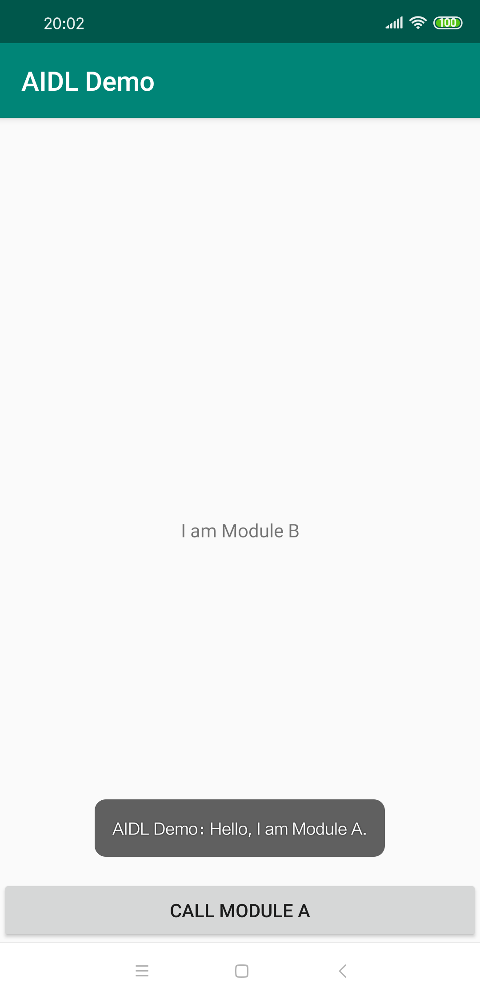

在做模块化开发的时候，一定会涉及模块间的解耦和通信。在解耦之后，页面间的跳转一般都是用路由实现；而接口调用，一般也都会采用ARouter这种带服务调用功能的功能强大的路由组件。

但其实Android本身就提供了一种接口调用方案 -- AIDL(Android Interface Definition Language)。无需引用额外的第三方库，原生态、无公害。

AIDL的语法、用法就不展开了，这里用一个Demo演示如何通过AIDL在两个无任何依赖的模块件进行接口调用。

## 基本结构

Demo的框架如下:


* **app** -- 作为demo的宿主, 整合其余三个module
* **framework** -- 作为基础框架，用于提供接口总线服务
* **module_a** -- 用于提供服务
* **module_b** -- 用于调用服务，但不依赖module_a

## 接口总线服务

由于服务提供者和调用者之间没有直接依赖，那就需要一个类似具有通信总线功能的服务，就是位于`framework`中的`InterfaceBusService`:

```kotlin
class InterfaceBusService : Service() {
    private val TAG = "InterfaceBusService"
    override fun onCreate() {
        super.onCreate()
        Log.d(TAG, "InterfaceBusService onCreate")
    }

    override fun onBind(intent: Intent?): IBinder? {
        Log.d(TAG, "InterfaceBusService onBind:$intent")
        val serviceId = intent?.action?:""
        return serviceMap[serviceId]
    }
}
```
`InterfaceBusService`维护了一个服务索引表`serviceMap`，通过收到的`serviceId`提供对应的服务Binder。

而服务调用者需要通过唤起这个service，通过action指定需要调用的具体服务的`serviceId`，拿到对应的Binder，来完成服务调用。

## 声明服务接口
这部分就是AIDL了，在framework下新建一个aidl文件：

```java
interface ISayHelloInterface {
    String hello();
}

```

## 实现接口功能
在module_a中，我们需要实现这个接口的具体功能：

```kotlin
class SayHelloService : ISayHelloInterface.Stub() {
    override fun hello(): String = "Hello, I am Module A."
}
```

## 调用接口
在module_b中的activity中有个button，点击则调用前面的服务接口，将得到的结果通过toast输出：

```kotlin
class ModuleBActivity : AppCompatActivity() {

    private var sayHelloServer: ISayHelloInterface? = null

    private var connected = false

    private val serviceConnection = object : ServiceConnection {
        override fun onServiceConnected(name: ComponentName, service: IBinder) {
            sayHelloServer = ISayHelloInterface.Stub.asInterface(service)
            connected = true
        }

        override fun onServiceDisconnected(name: ComponentName) {
            connected = false
        }
    }

    override fun onCreate(savedInstanceState: Bundle?) {
        super.onCreate(savedInstanceState)
        setContentView(R.layout.activity_module_b)

        call_module_a.setOnClickListener {
            sayHelloServer?.hello()?.let {
                Toast.makeText(this@ModuleBActivity, it, Toast.LENGTH_LONG).show()
            }
        }

        bindService()
    }

    override fun onDestroy() {
        super.onDestroy()
        if (connected) {
            unbindService(serviceConnection)
        }
    }

    private fun bindService() {
        bindService(
            Intent().apply {
                setClass(this@ModuleBActivity, InterfaceBusService::class.java)
                action = SERVICE_SAY_HELLO
            },
            serviceConnection,
            Context.BIND_AUTO_CREATE
        )
    }

}
```

点击按钮就能看到输出了：



## 总结
整个过程非常简单，原理也不难，只要用过AIDL进行通信的都能理解。但这个demo中的服务索引表是静态的，在最终实际应用的时候，还需要解决动态生成的问题。通过注解 + Processor或者Gradle Transformer，这个问题应该不难解决。
