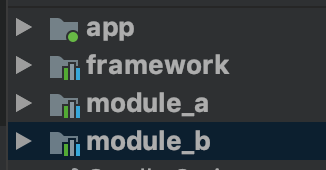
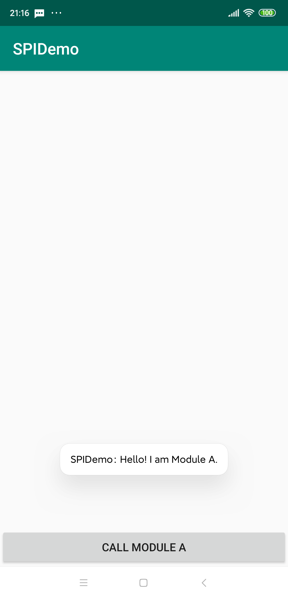

前面介绍了使用AIDL做为模块化开发的解耦工具，但其实Java自身的SPI（Service Provider Interface）机制也可做到，更简单，同样无需引用额外的第三方库，原生态、无公害。


## 基本结构

Demo的框架跟之前一样如下:



* **app** -- 作为demo的宿主, 整合其余三个module
* **framework** -- 作为基础框架，用于提供接口总线服务
* **module_a** -- 用于提供服务
* **module_b** -- 用于调用服务，但不依赖module_a


## 声明服务接口
在framework下新建一个接口：

```kotlin
interface ISayHelloService {
    fun sayHello(): String
}

```

## 实现接口功能
在module_a中，我们需要实现这个接口的具体功能：

```kotlin
@AutoService(ISayHelloService::class)
class SayHelloService : ISayHelloInterface {
    override fun hello(): String = "Hello, I am Module A."
}
```

这里使用了AutoService来进行实例的注册，当然也可以手动配置，在main目录下新建：
`resources/META-INFO/services/com.ezstudio.framework. ISayHelloService`，内容填写：

```
com.ezstudio.module_a.SayHelloService
```

## 调用接口
在module_b中的activity中有个button，点击则调用前面的服务接口，将得到的结果通过toast输出，跟之前的区别是，这里使用了ServiceLoader来发现服务：

```kotlin
class ModuleBActivity : AppCompatActivity() {

    override fun onCreate(savedInstanceState: Bundle?) {
        super.onCreate(savedInstanceState)
        setContentView(R.layout.activity_module_b)

        call_module_a.setOnClickListener {
            val loader = ServiceLoader.load(ISayHelloService::class.java)

            loader.firstOrNull()?.sayHello()?.let {
                Toast.makeText(this@ModuleBActivity, it, Toast.LENGTH_LONG).show()
            }
        }
    }
}
```
`ServiceLoader.load`返回一个ServiceLoader，ServiceLoader实现了Iterable接口，可以遍历所有配置的服务实例。

点击按钮就能看到输出了：



## 总结
目前已知最简单的接口通信。相比AIDL的方式，缺点是不支持跨进程，需要在接口实现的地方自己处理。
