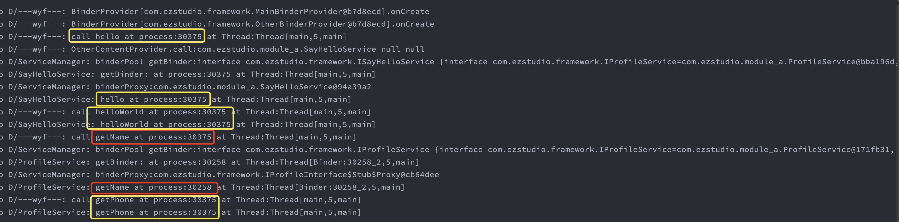

最近想将路由框架加入跨进程的方法调用能力。首先想到的就是AIDL，一般所定义的AIDL接口，通常一个接口下的所有方法都是同时支持跨进程的。可是我想要这样的一种接口，可以同时拥有支持跨进程和不需要跨进程的方法：

```java
public interface IProfileService {

    @Process(name = "main")
    String getName();

    String getPhone();

}
```
* getName()指定了必须运行在主进程
* getPhone()没有指定，跟随调用方所在的进程

单纯的AIDL接口或者单纯的Java接口肯定都是解决不了的。那么将两者结合呢？

定义一个AIDL接口`IProfileInterface.aidl`

```java
interface IProfileInterface {
    String getName();
}
```

实现类`ProfileService` 同时实现`IProfileService`和`IProfileInterface.Stub`

```java
class ProfileService : IProfileService, IProfileInterface.Stub() {

    override fun getName(): String {
        Log.d("ProfileService", "getName at process:${Process.myPid()} at Thread:${Thread.currentThread()}")
        return "Enzo Wei"
    }

    override fun getPhone(): String {
        Log.d("ProfileService", "getPhone at process:${Process.myPid()} at Thread:${Thread.currentThread()}")
        return "010-123456"
    }

}
```

但是这样肯定还是不行的，AIDL的产物除了有个`IProfileInterface.Stub`，还有个`IProfileInterface.Stub.Proxy`，发生IPC的时候会拿到Proxy实例，而这个Proxy是没有getPhone的，直接调用，肯定会crash。

那怎么办呢，一般路由通过查表拿到接口实现，返回给调用方，那我们可以在这里做文章，不直接提供接口实现，而是返回一个代理，代理发生调用的时候判断一下方法是否打上了`@Process`注解，有则走AIDL的Proxy类，没有则直接调用service的实现。同时，因为我们的路由框架是不知道具体service是什么，所以还需要让service提供对应的`IBinder`以及对`IProfileInterface.Stub.asInterface`做个包装，做一个所有service接口的父接口`ISerivce`，并让`IProfileService`继承`ISerivce`：

```java
public interface IService {

    IBinder getBinder();

    IInterface getInterface(IBinder binder);
}

public interface IProfileService extends IService { ... }
```
然后在实现类`ProfileService`实现这两个方法：

```kotlin
class ProfileService : IProfileService, IProfileInterface.Stub() {

    ...
    
    override fun getBinder(): IBinder {
        return this
    }

    override fun getInterface(binder: IBinder?): IInterface {
        return asInterface(binder)
    }
}
```

在路由框架中提供IBinder和实现代理：

```kotlin
    fun attach(binderProvider: IBinderProvider) {
            binderProvider.attach { clazz ->
                serviceMap[clazz]!!.binder
            }
    }
    
    private fun <T : IService> generateProxy(clazz: Class<T>, service: T): T {
        return Proxy.newProxyInstance(clazz.classLoader, arrayOf(clazz)) { proxy, method, args ->
            val binderAnnotation = method.getAnnotation(Process::class.java)
            if (binderAnnotation != null) {
                if (processList.any { processName -> processName == binderAnnotation.name }) {
                    val binderProxy = proxyMap[clazz] ?: getProxy(binderAnnotation.name, service)

                    val binderMethod = binderProxy!!.javaClass.getMethod(method.name, *method.parameterTypes)
                    invokeMethod(binderProxy!!, binderMethod, args)
                } else {
                    invokeMethod(service, method, args)
                }
            } else {
                invokeMethod(service, method, args)
            }
        } as T
    }
    
    private fun getProxy(process: String, service: IService): Any? {
        val bundle = GlobalContext.app.contentResolver.call(
            Uri.parse("content://process_dispatcher_${process}"),
            service.javaClass.name,
            null,
            null
        )

        return service.getInterface(bundle?.getBinder("binder"))
    }

    private fun invokeMethod(obj: Any, method: Method, args: Array<Any>?): Any? {
        return if (args.isNullOrEmpty()) {
            method.invoke(obj)
        } else {
            method.invoke(obj, *args)
        }
    }
```

这里使用了ContentProvider.call方法来启动线程、拿到binder，这个过程是同步的，写法也简单很多

MainBinderProvider的实现(其实是ContentProvider的子类)：

```kotlin
class MainBinderProvider : AbstractBinderProvider() {

    override fun call(method: String, arg: String?, extras: Bundle?): Bundle? {

        val binder = getBinder(IProfileService::class.java)

        return Bundle().apply {
            putBinder("binder", binder)
        }
    }
}
```

##Demo

最后是，Demo提供了两个进程main和other，以及两个service：`IProfileServiceI`和`SayHelloService`：

```java
public interface IProfileService {

    @Process(name = "main")
    String getName();

    String getPhone();

}

public interface ISayHelloService extends IService {
    @Process(name = "other")
    void hello();

    String helloWorld(String name);
}

```

其中`IProfileService.getName`指定运行在主进程，而`IProfileService.getPhone`未指定进程；
`ISayHelloService. hello`指定运行在other进程，而`ISayHelloService.helloWorld`未指定进程；

另外ModuleBActivity运行在other进程，在ModuleBActivity中调用上面四个方法，看看结果：


* 调用`IProfileService.getName`时可以明显看到从进程30375跨到了30258
* 调用`ISayHelloService. hello`时，由于调用双方处于同一进程，进程号没有发生变化，线程也是一样的
* 调用`IProfileService.getPhone`和`ISayHelloService.helloWorld`，由于这两个方法未指定进程，所以跟调用方处于同一进程

从Demo的结果可以看到，达到我们最初的目的：在同一个接口下，可以按方法级部署于不同的进程。

Demo地址：[https://github.com/enzowyf/ipc_router_demo](https://github.com/enzowyf/ipc_router_demo)
