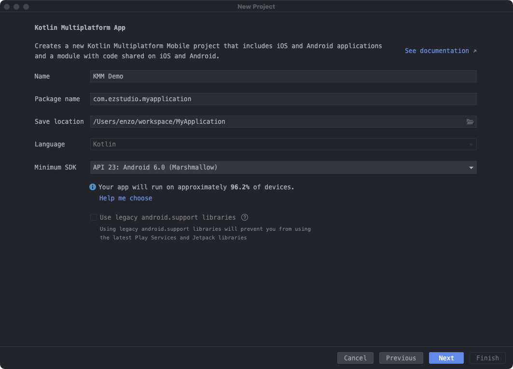
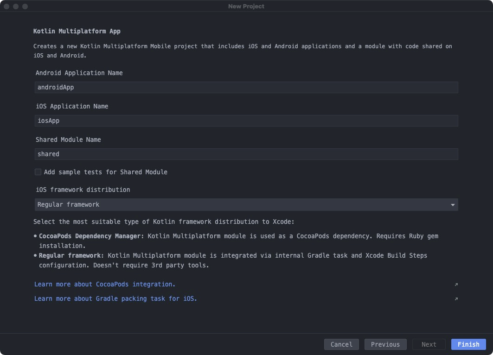
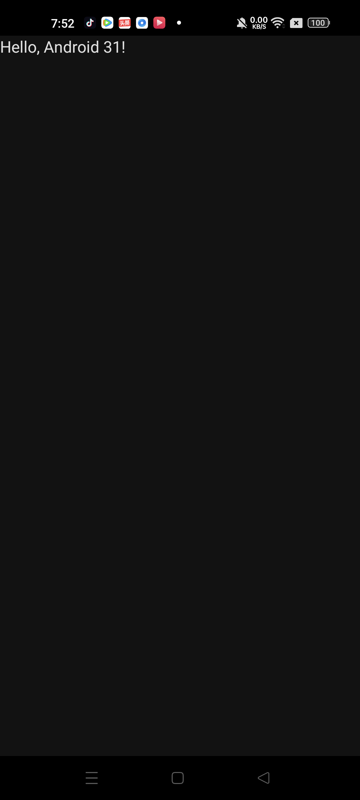

# KMM 初探

## 环境搭建

按照官方文档[Get started with Kotlin Multiplatform Mobile \| Kotlin Documentation](https://kotlinlang.org/docs/multiplatform-mobile-getting-started.html)一步一步来即可：

安装检查工具kdoctor并运行之：

> brew install kdoctor
> kdoctor


工具检查下面几个环境：

1. mac os
2. java 环境
3. Adnroid studio
4. Xcode
5. Cocoapods

需要注意的有:

#### Xcode requires to perform the First Launch tasks
要求Launch Xcode or execute 'xcodebuild -runFirstLaunch' in terminal

在命令行运行xcodebuild -runFirstLaunch可能会报错：

```
xcode-select: error: tool 'xcodebuild' requires Xcode, but active developer directory '/Library/Developer/CommandLineTools' is a command line tools instance
```

这个时候需要：

> sudo xcode-select -s /Applications/Xcode.app/Contents/Developer
> xcodebuild -runFirstLaunch

即可

#### cocoapods not found

需要安装cocoapods：

> sudo gem install cocoapods


### Kotlin Multiplatform Mobile plugin
需要在Android Studio中安装KMM插件：
`Settings/Preferences | Plugins | Marketplace`中搜索`Kotlin Multiplatform Mobile`即可

另外kdoctor会提示：
```
Android Studio 2021.3 has the issue with running shared unit tests via run gutters
```
忽略即可，这个时候：

 ✓ Your system is ready for Kotlin Multiplatform Mobile Development!
 
 ## 创建KMM App
 在Android Studio中：
 `File | New | New Project.`选择`Kotlin Multiplatform App`
 
* 第一步: 跟以前一样，起app名，包名，选择最小sdk等等：


* 然后多了个KMM的选项：

前面是指定android app、ios app、共享模块的名称，默认即可

主要是区别是iOS framework distribution：

* Regular framework: 整合了KMM框架，配置简单
* CocoaPods Dependency Manager: 需要自己配置KMM的CocoaPods依赖

一般成熟的项目都用到了CocoaPods，这里就一步到位吧

可以看下创建好的工程目录，有三个gradle module，名字都是上一步指定的：

* shared

从build.gradle文件看：

```
plugins {
    kotlin("multiplatform")
    kotlin("native.cocoapods")
    id("com.android.library")
}
```
首先它是一个android library模块，同时应用了kmm插件和cocoapods插件

然后是配置cocoapods：

```
kotlin {
    cocoapods {
        summary = "Some description for the Shared Module"
        homepage = "Link to the Shared Module homepage"
        version = "1.0"
        ios.deploymentTarget = "14.1"
        podfile = project.file("../iosApp/Podfile")
        framework {
            baseName = "shared"
        }
    }
}
```

最后再设置各个依赖
```
kotlin {
    sourceSets {
        val commonMain by getting
        val commonTest by getting {
            dependencies {
                implementation(kotlin("test"))
            }
        }
        val androidMain by getting
        val androidTest by getting
        val iosX64Main by getting
        val iosArm64Main by getting
        val iosSimulatorArm64Main by getting
        val iosMain by creating {
            dependsOn(commonMain)
            iosX64Main.dependsOn(this)
            iosArm64Main.dependsOn(this)
            iosSimulatorArm64Main.dependsOn(this)
        }
        val iosX64Test by getting
        val iosArm64Test by getting
        val iosSimulatorArm64Test by getting
        val iosTest by creating {
            dependsOn(commonTest)
            iosX64Test.dependsOn(this)
            iosArm64Test.dependsOn(this)
            iosSimulatorArm64Test.dependsOn(this)
        }
    }
}
```

其实上面大多数sourceSet都不需要，只需要保留三个即可：
  * commonMain，跨平台的共享代码，包括公共的接口、数据类、通用实现和公共的依赖
  * androidMain，需要由android实现的扩展
  * iosMain，需要由ios实现的扩展

通过这种方式可以给不同的sourceSet提供不同的依赖，例如有些库只提供了android版本，而有些kt库可以运行在KMM下（Kotlin声称大多数kt库都可以）


### androidApp

即android端的工程文件，从build.gradle看跟普通的android工程模块没有区别，依赖了shared模块

### iosApp

即ios端的工程文件，标准的ios工程，通过Pods依赖了shared模块

```
target 'iosApp' do
  use_frameworks!
  platform :ios, '14.1'
  pod 'shared', :path => '../shared'
end
```

### 运行工程

androidApp 和 iosApp都可以在android studio里面运行，结果如下：



